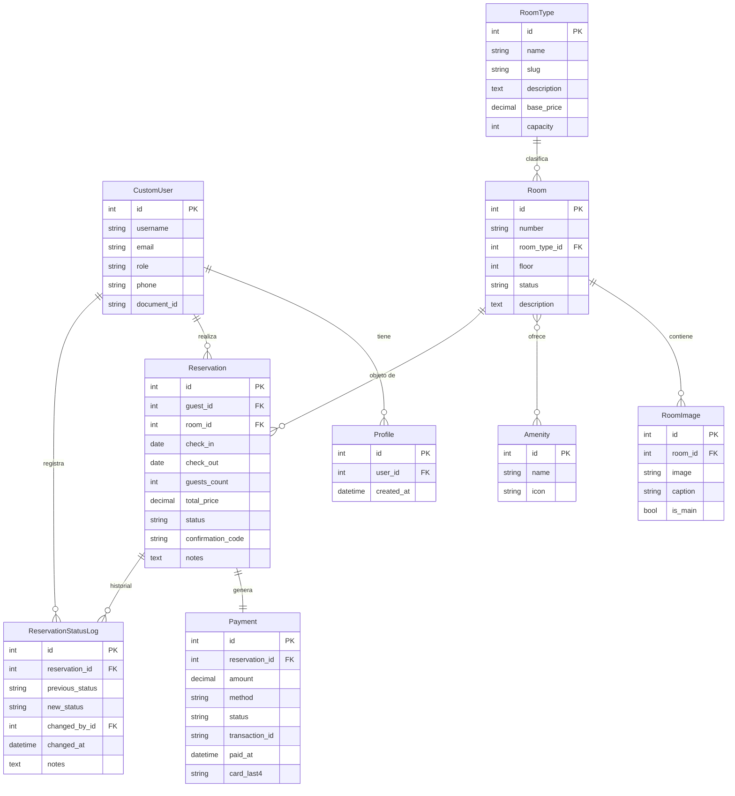
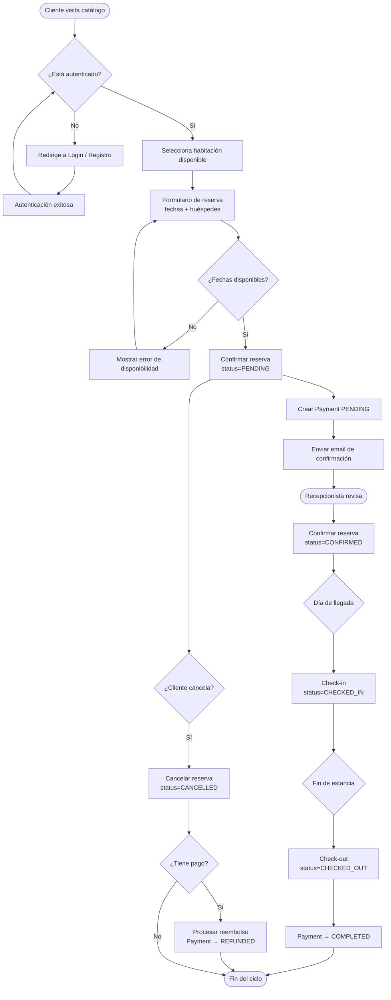
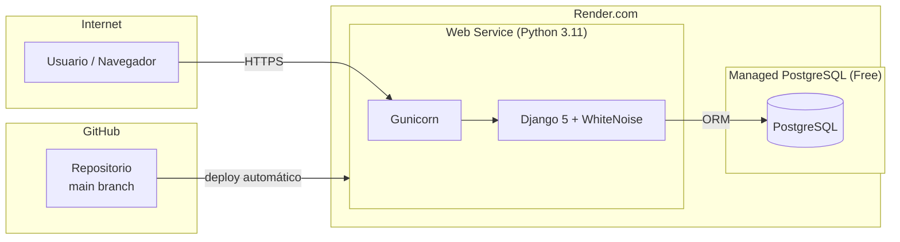

# Informe Final — Sistema de Reservas de Hotel

**Título:** Sistema de Gestión de Reservas Hoteleras  
**Institución:** Universidad  
**Asignatura:** Desarrollo de Aplicaciones Web  
**Fecha:** Mayo 2025  

**Autores:**  
- Santy — Líder técnico (accounts, reservations)  
- Samuel — Módulo rooms  
- Pipe — Módulo dashboard  
- Juanjo (Ronald F.) — Deploy, documentación  

---

## 1. Objetivo general

Desarrollar una plataforma web completa para la gestión de reservas de un hotel boutique, con control de disponibilidad de habitaciones, administración de reservas, registro de pagos y panel analítico, utilizando el framework Django 5 bajo el patrón MVT.

## 2. Objetivos específicos

1. Implementar un sistema de autenticación con tres roles: Administrador, Recepcionista y Cliente.
2. Construir el módulo de habitaciones con catálogo público, CRUD administrativo e imágenes.
3. Diseñar el flujo completo de reservas: creación, confirmación, check-in, check-out y cancelación.
4. Desarrollar un panel analítico con gráficas en tiempo real y exportación de reportes PDF/Excel.
5. Desplegar la aplicación en Render con PostgreSQL y configuración de seguridad para producción.

---

## 3. Descripción del sistema

El sistema permite a los clientes consultar el catálogo de habitaciones disponibles, realizar reservas en línea y recibir confirmación por correo electrónico. Los recepcionistas gestionan el ciclo de vida de cada reserva (check-in, check-out, cancelaciones y reembolsos). Los administradores acceden al panel de analíticas con métricas de ocupación, ingresos por mes y habitaciones más solicitadas, con posibilidad de exportar reportes.

---

## 4. Arquitectura MVT

El proyecto sigue el patrón **Model-View-Template** de Django:

| Capa | Descripción | Archivos |
|------|-------------|---------|
| **Model** | Definición de entidades y lógica de negocio | `*/models.py`, `*/migrations/` |
| **View** | Lógica de presentación (CBVs y FBVs) | `*/views.py`, `dashboard/views/` |
| **Template** | Renderizado HTML con Jinja/Django templates | `*/templates/`, `templates/` |
| **URL** | Enrutamiento de peticiones | `*/urls.py`, `core/urls.py` |
| **Form** | Validación de entrada | `*/forms.py` |

---

## 5. Diagrama ER

---

## 6. Diagrama de flujo — Proceso de reserva

---

## 7. Diagrama de despliegue

---

## 8. Rutas principales por módulo

### Accounts (`/accounts/`)

| Método | Ruta | Vista | Acceso |
|--------|------|-------|--------|
| GET/POST | `/accounts/login/` | login_view | Público |
| GET | `/accounts/logout/` | logout_view | Autenticado |
| GET/POST | `/accounts/register/` | register | Público |
| GET/POST | `/accounts/profile/` | profile | Autenticado |

### Rooms (`/rooms/`)

| Método | Ruta | Vista | Acceso |
|--------|------|-------|--------|
| GET | `/rooms/` | RoomListView | Público |
| GET | `/rooms/<id>/` | RoomDetailView | Público |
| GET | `/rooms/admin/` | RoomAdminListView | Admin/Recep |
| GET/POST | `/rooms/admin/crear/` | RoomCreateView | Admin |
| GET/POST | `/rooms/admin/<id>/editar/` | RoomUpdateView | Admin |
| POST | `/rooms/admin/<id>/eliminar/` | RoomDeleteView | Admin |

### Reservations (`/reservations/`)

| Método | Ruta | Vista | Acceso |
|--------|------|-------|--------|
| GET | `/reservations/` | ReservationListView | Autenticado |
| GET/POST | `/reservations/crear/` | ReservationCreateView | Cliente |
| GET | `/reservations/<id>/` | ReservationDetailView | Propietario/Admin |
| POST | `/reservations/<id>/cancelar/` | ReservationCancelView | Propietario/Admin |
| GET | `/reservations/admin/` | AdminReservationListView | Admin/Recep |

### Dashboard (`/dashboard/`)

| Método | Ruta | Vista | Acceso |
|--------|------|-------|--------|
| GET | `/dashboard/` | DashboardIndexView | Admin/Recep |
| GET | `/dashboard/reportes/` | ReportsView | Admin/Recep |
| GET | `/dashboard/api/reservations-by-month/` | reservations_by_month_api | Admin/Recep |
| GET | `/dashboard/api/revenue-by-month/` | revenue_by_month_api | Admin/Recep |
| GET | `/dashboard/api/top-rooms/` | top_rooms_api | Admin/Recep |
| GET | `/dashboard/reportes/reservas/pdf/` | export_reservations_pdf | Admin/Recep |
| GET | `/dashboard/reportes/reservas/excel/` | export_reservations_excel | Admin/Recep |

---

## 9. Roles y permisos

| Acción | Cliente | Recepcionista | Administrador |
|--------|---------|--------------|---------------|
| Ver catálogo de habitaciones | ✅ | ✅ | ✅ |
| Crear reserva propia | ✅ | ✅ | ✅ |
| Ver sus propias reservas | ✅ | ✅ | ✅ |
| Ver todas las reservas | ❌ | ✅ | ✅ |
| Confirmar / hacer check-in | ❌ | ✅ | ✅ |
| Crear / editar habitaciones | ❌ | ❌ | ✅ |
| Acceder al dashboard | ❌ | ✅ | ✅ |
| Exportar reportes | ❌ | ✅ | ✅ |
| Gestionar usuarios | ❌ | ❌ | ✅ |

---

## 10. Capturas de pantalla

> Las capturas se encuentran en `docs/imgs/`. Agregar imágenes reales antes de la entrega final.

| Pantalla | Archivo |
|----------|---------|
| Página de inicio | `docs/imgs/home.png` |
| Catálogo de habitaciones | `docs/imgs/rooms_catalog.png` |
| Detalle de habitación | `docs/imgs/room_detail.png` |
| Formulario de reserva | `docs/imgs/reservation_form.png` |
| Listado de reservas (cliente) | `docs/imgs/my_reservations.png` |
| Panel administración reservas | `docs/imgs/admin_reservations.png` |
| Dashboard principal | `docs/imgs/dashboard.png` |
| Reportes / exportación | `docs/imgs/reports.png` |

---

## 11. División del trabajo y commits

| Integrante | Módulo principal | Commits destacados |
|------------|-----------------|-------------------|
| **Santy** | Setup, accounts, reservations | `feat: estructura base`, `feat: implementar flujo de reservas` |
| **Samuel** | rooms | `feat(rooms): migraciones iniciales`, `feat(rooms): seed_rooms` |
| **Pipe** | dashboard | `feat(dashboard): agregar vistas, endpoints y reportes` |
| **Juanjo** | Deploy, docs | `feat(deploy): producción Render, seed_all, README, informe` |

---

## 12. Conclusiones

1. **Django 5 + MVT** resultó la arquitectura ideal para este proyecto: separación clara de responsabilidades, ORM robusto y administración de formularios sin configuración extra.

2. **Render + PostgreSQL gratuita** ofrece un entorno de producción funcional para proyectos académicos sin costo, con despliegue automatizado desde GitHub.

3. **WhiteNoise** simplificó el servicio de archivos estáticos sin necesidad de un CDN externo, manteniendo la infraestructura mínima.

4. **Chart.js** junto a las APIs JSON del dashboard facilitó la construcción de métricas interactivas sin dependencias adicionales del servidor.

5. La **división modular** del trabajo permitió desarrollar en paralelo sin conflictos graves de integración, validando la metodología de branches por feature.

6. El **sistema de roles** con tres niveles de acceso garantiza que cada usuario solo opere sobre los recursos que le corresponden, mejorando la seguridad de la aplicación.
